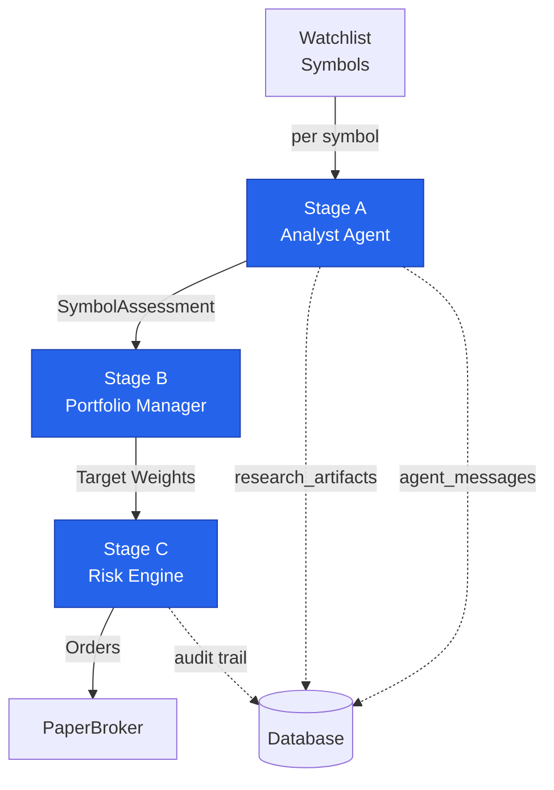
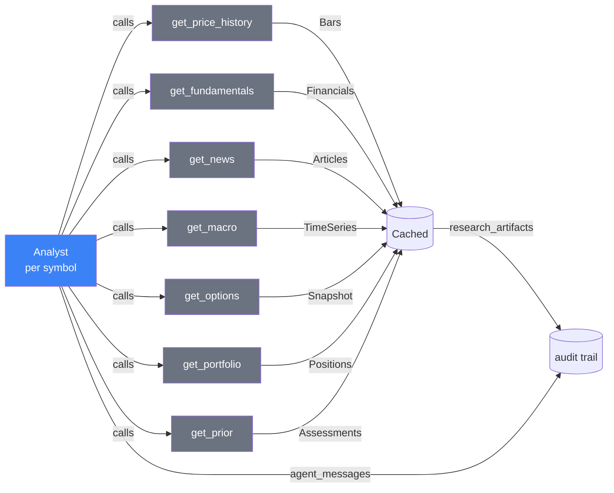
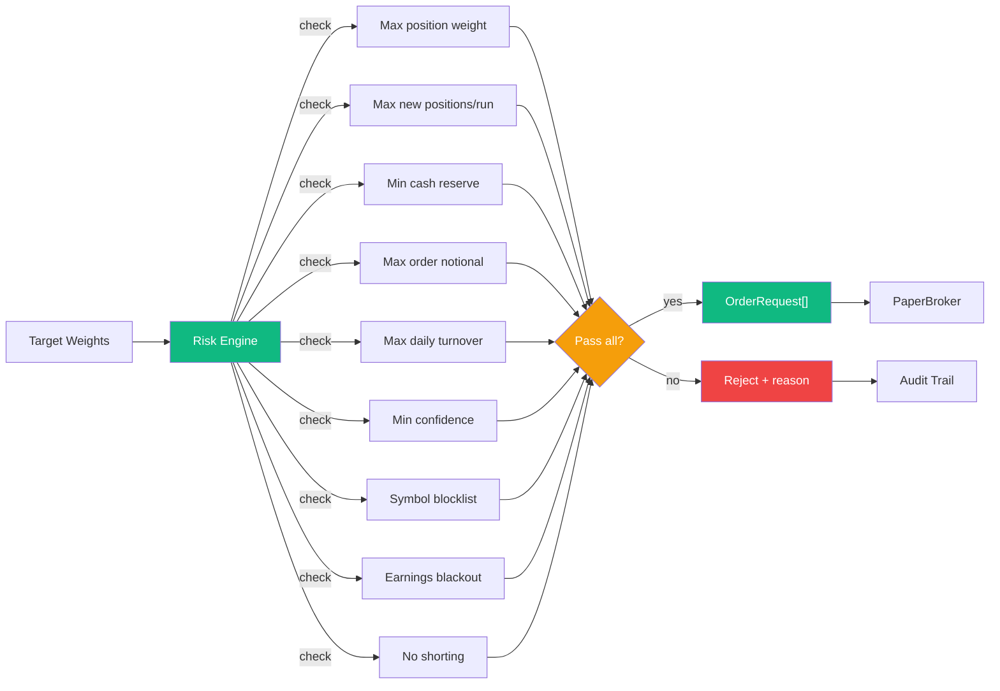

# 03 — LLM Agent & Trading Design

[← back to index](README.md)

## Three stages: LLM proposes, code disposes

**Stage A — Analyst (per symbol, LangGraph `createReactAgent` with tools).**
Same shape as lexchat's `buildLexiconAgent` — `createReactAgent({ llm, tools,
prompt })` invoked with a `recursionLimit`, events streamed via
`streamEvents({ version: "v2" })` into a collector modeled on
`agentCollector.ts`. The model decides which sources a given name needs.
Output: a `SymbolAssessment` via `withStructuredOutput(AssessmentSchema)`.

Tools (all **read-only**):

Every tool invocation writes an `agent_messages` row and its result an
`research_artifacts` row, keyed to `run_id` + `symbol`. That is the audit
trail.

**Stage B — Portfolio Manager (one call, no tools).** Input: all assessments,
current positions, cash, risk parameters. Uses
`withStructuredOutput(DecisionSetSchema)` — target weights + rationale per
symbol. No tools, because this stage must return deterministic
machine-readable output.

**Stage C — Risk & sizing (`services/riskService.ts`, pure TypeScript, no LLM).** Converts target weights → share quantities → `OrderRequest[]`. Every rejection is recorded with a reason on the run.

**There is deliberately no `submit_order` tool.** The model cannot place an
order. Orders exist only as the output of Stage C. This is the core safety
property and the reason for the hybrid rather than a pure open-ended ReAct
agent over the whole cycle — it also bounds token cost and guarantees
evidence is persisted rather than left to the model's discretion.

## Daily-not-intraday cadence

**Daily Schedule (ET):**
- **09:30–16:00** — Market trading hours
- **16:30** — Agent job runs (default cron `30 16 * * 1-5`)
  - Stage A: Analyst agent (per symbol)
  - Stage B: Portfolio Manager
  - Stage C: Risk Engine
  - Orders → PaperBroker
- **16:45** — Snapshot job runs (independent of agent)
  - Captures `portfolio_snapshots`
  - Captures `benchmark_snapshots` (SPY)
  - Runs even if agent was skipped

**Timing & Guards:**
- `scheduler/index.ts` uses croner with `timezone: settings.schedule.timezone` (default `America/New_York`). Default cron `30 16 * * 1-5` — 16:30 ET, after the close, so the cycle reasons over settled daily bars.
- `marketCalendar.ts` holds a hardcoded NYSE holiday + early-close table (through 2030, ~50 lines, no API). The job **skips** on holidays and records `agent_runs.status='skipped'` with a `skip_reason`.
- **Structural guard against intraday drift:** settings validation rejects any schedule that would fire more often than `schedule.minIntervalHours` (default 12) — the cron expression's computed next-N intervals are checked in the zod refinement. Not just a convention; the config layer enforces it.
- A single-run lock: refuse to start if any `agent_runs.status='running'`; stale runs older than `runTimeoutMinutes` are marked `failed`.
- Kill switch `settings.trading.enabled`; manual `POST /api/runs` "Run now".
- A **second, independent daily job at 16:45 ET** writes `portfolio_snapshots` + `benchmark_snapshots` regardless of whether the agent ran, so the SPY comparison series stays continuous.

---
[← Broker & Data Sources](02-broker-and-data-sources.md) · [back to index](README.md) · [next: UI & Deployment →](04-ui-and-deployment.md)
