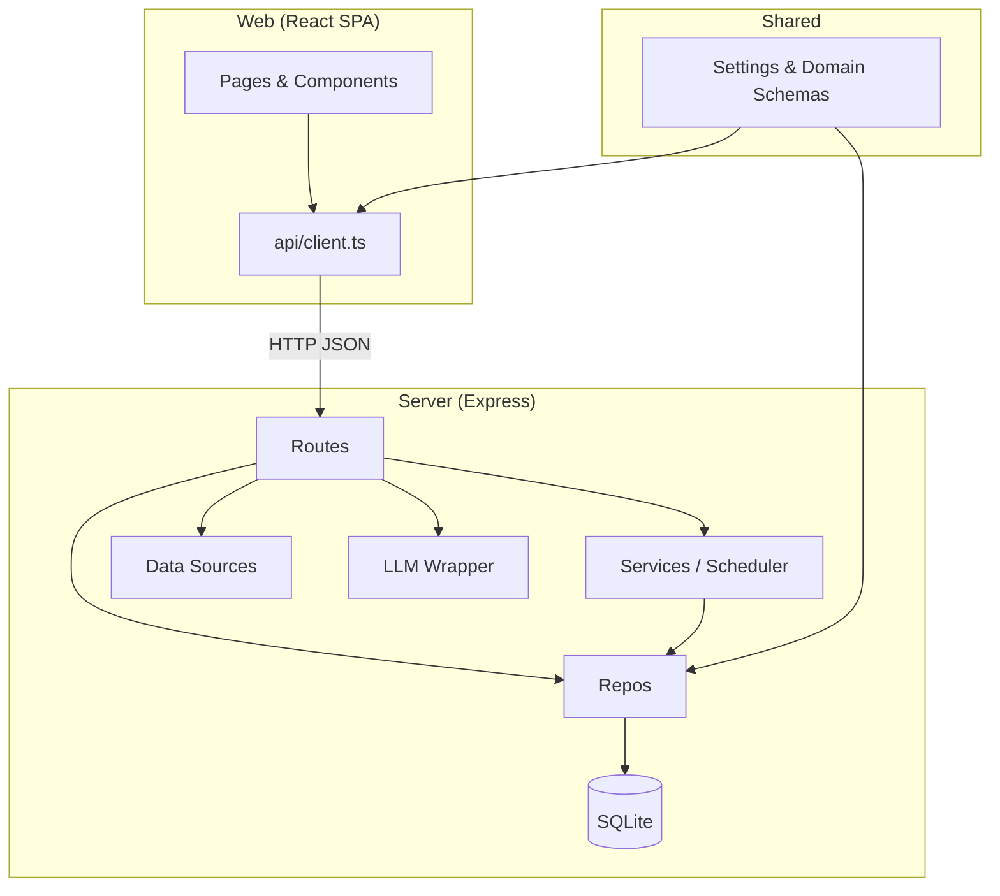
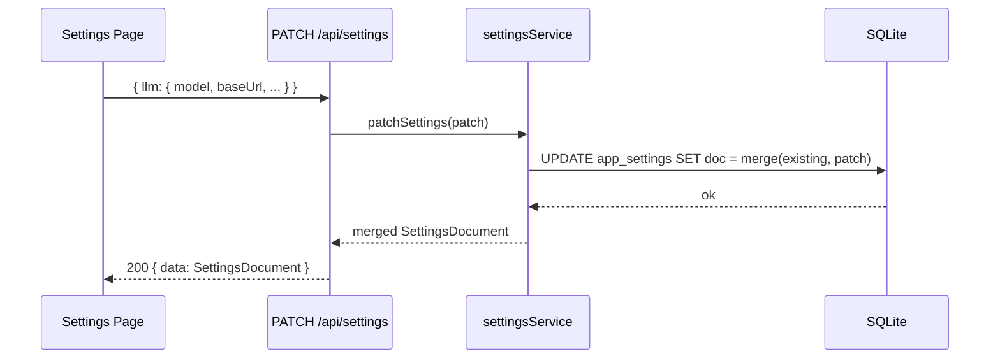
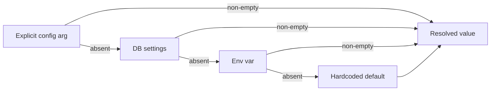
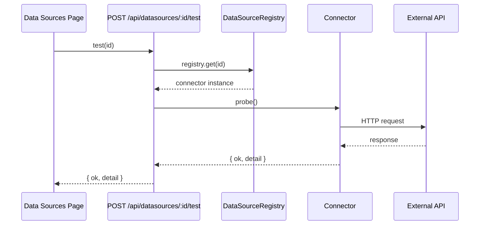
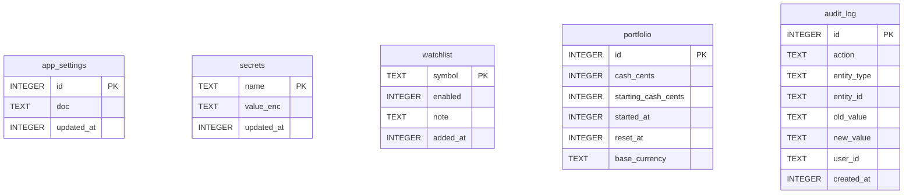

# Architecture

atn-trd is a self-hosted autonomous paper-trading system built as a Node.js monorepo.

## Directory Layout

```
atn-trd/
├── shared/          # Zod schemas shared between server and web
│   └── src/
│       ├── settings.ts   # SettingsSchema + defaults
│       ├── domain.ts     # Shared domain types
│       └── api.ts        # Shared API response shapes
├── server/          # Express API + scheduler + LLM + data sources
│   └── src/
│       ├── main.ts            # Entry point: DB → scheduler → Express
│       ├── app.ts             # Route registration
│       ├── config/            # Settings service (read/write/resolve)
│       ├── db/                # SQLite connection + migrations runner
│       ├── repos/             # Data access (settings, secrets, watchlist, portfolio)
│       ├── routes/            # Express route handlers
│       ├── datasources/       # External data connectors (news, fundamentals, macro, options, prices)
│       ├── llm/               # OpenAI-compatible chat model wrapper
│       ├── scheduler/         # croner scheduler + market calendar
│       ├── services/          # Business logic (symbol validation)
│       └── lib/               # Shared utilities (errors, logger, money, secretBox)
├── web/             # React SPA (Vite + TypeScript)
│   └── src/
│       ├── api/           # Typed HTTP client
│       ├── components/    # Reusable UI components
│       ├── context/       # React context (Toast)
│       └── pages/         # Route pages
├── docs/            # Design documents and architecture reference
├── Dockerfile       # Multi-stage production image
└── docker-compose.yml
```

## Module Boundaries



## Data Flow: Settings Write



## Data Flow: LLM Config Resolution



Applies to **model**, **baseUrl**, **API key** (key checks secret store instead of DB settings).

## Data Flow: Data Source Test



## Database Schema (Phase 1)



## Key Design Decisions

### Singleton settings document
`app_settings` holds a single JSON document (`id = 1`). Reads deserialize + validate with Zod; writes deep-merge the patch over the existing document. This avoids per-field schema migrations as settings evolve.

### Encrypted secret store
API keys are stored in `secrets.value_enc` using XSalsa20-Poly1305 (`lib/secretBox.ts`). The encryption key is `ATN_ENC_KEY` (hex, 32 bytes), required at startup. Keys are never logged or returned in API responses.

### Repos own SQL
All SQL lives in `repos/`. Routes and services call repo methods — never `db.prepare()` directly.

### Env-var fallback for LLM config
DB values take precedence; env vars (`LLM_API_KEY`, `LLM_API_URL`, `LLM_MODEL`) serve as fallbacks so Docker deployments work without touching the DB.

### Single Node process
Express routes and the croner scheduler run in the same process. Both are I/O-bound; no worker threads needed in Phase 1.
