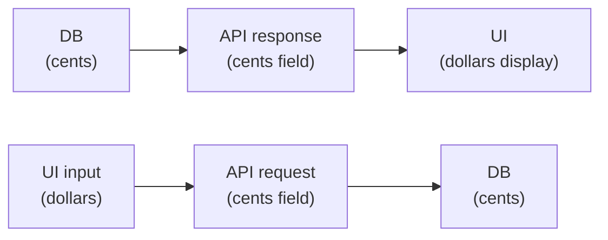
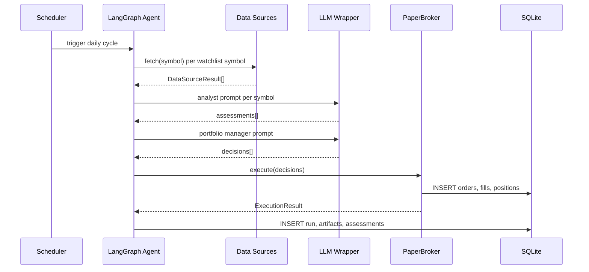

# Coding Guidelines

Practical rules for contributors working on Phase 2 and beyond.

## 1. Cents-not-floats: all money via `lib/money.ts`

All monetary values are stored and computed in integer cents. Never use floating-point arithmetic on money.

```ts
// ✅ correct
import { toCents, fromCents, notionalCents } from '../lib/money.js';

const priceCents = toCents(142.57);          // 14257
const notional   = notionalCents(10, priceCents); // 142570
const display    = fromCents(notional);       // 1425.70

// ❌ wrong — floating-point rounding errors compound over many fills
const notional = 10 * 142.57; // 1425.6999999999998
```

Database columns that hold money end in `_cents` (e.g., `cash_cents`, `starting_cash_cents`, `max_order_notional_cents`).

---

## 2. Repos own SQL

Data access lives exclusively in `server/src/repos/`. Routes and services call repo methods — they never call `db.prepare()` directly.

```ts
// ✅ correct — route calls the repo
import { getWatchlist } from '../repos/watchlistRepo.js';
app.get('/api/watchlist', (req, res) => {
  const symbols = getWatchlist();
  res.json({ data: symbols });
});

// ❌ wrong — SQL in a route
app.get('/api/watchlist', (req, res) => {
  const rows = db.prepare('SELECT * FROM watchlist').all();
  res.json({ data: rows });
});
```

---

## 3. Routes call services, not data sources or brokers directly

The call chain is: **Route → Service/Scheduler → DataSource/Broker**. Routes never import connector classes.

```ts
// ✅ correct
import { runDailyCycle } from '../services/tradingService.js';
app.post('/api/run', async (req, res) => {
  const result = await runDailyCycle();
  res.json(result);
});

// ❌ wrong — route reaches into a connector
import { FinnhubNewsDataSource } from '../datasources/news/finnhubNews.js';
app.get('/api/news', async (req, res) => { ... });
```

---

## 4. Connectors never throw into a run — return `{ ok, detail }`

Data source connectors used during an agent run must catch their own errors and return a typed result. Throwing crashes the whole run.

```ts
// ✅ correct — connector returns structured error
async function fetchNews(symbol: string): Promise<NewsResult> {
  try {
    const data = await connector.fetch({ symbol });
    return { ok: true, data };
  } catch (err) {
    return { ok: false, detail: err instanceof Error ? err.message : String(err) };
  }
}

// ❌ wrong — unhandled throw kills the agent run
async function fetchNews(symbol: string) {
  return connector.fetch({ symbol }); // throws on network error
}
```

The test-connection routes (`POST /api/datasources/:id/test`) are the exception — they intentionally surface errors as HTTP responses.

---

## 5. No secrets in logs or API responses

Strip API keys before logging. Never include secret values in any JSON response body.

```ts
// ✅ correct
log.info('resolving api key', { name: secretName, found: key !== undefined });

// ❌ wrong
log.info('resolved api key', { key }); // key appears in log output
```

The secrets API returns `{ name, isSet, updatedAt }` — never the plaintext value. The same applies to settings: `LLM_API_KEY` stored in the secret store must never appear in a `GET /api/settings` response.

---

## 6. Validate at boundaries, trust internally

Validate with Zod at HTTP boundaries (request bodies, external API responses). Internal function calls between modules trust their TypeScript types.

```ts
// ✅ correct — validate incoming HTTP body
const parsed = PatchSettingsSchema.safeParse(req.body);
if (!parsed.success) return res.status(400).json({ error: parsed.error });

// ❌ wrong — redundant runtime check on internal data already typed
function applyRisk(decision: Decision) {
  if (!decision || typeof decision.symbol !== 'string') throw new Error('...');
}
```

---

## 7. Error classes, not string matching

Throw typed errors from `lib/errors.ts`. Route handlers inspect the error class to decide the HTTP status code — never `.message.includes('...')`.

```ts
// ✅ correct
throw new DataSourceNotConfiguredError('Finnhub news', 'FINNHUB_API_KEY');
throw new SymbolNotFoundError(symbol);
throw new ValidationError('Symbol is required');

// ❌ wrong
throw new Error('not configured');     // loses type information
throw new Error(`symbol ${symbol} not found`);
```

---

## 8. Money display flow



The UI converts cents ↔ dollars locally. The API always speaks cents. Example: `startingCashCents: 100000` → UI shows `$1,000.00`.

---

## 9. Agent run data flow (Phase 2 preview)



Connectors return `{ ok, data }` or `{ ok: false, detail }` — never throw. The agent logs each stage to `artifacts` for auditability.
